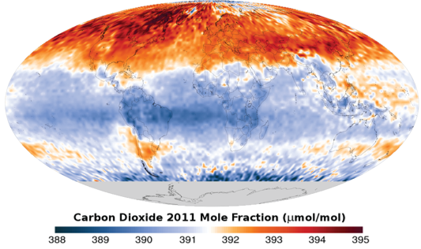
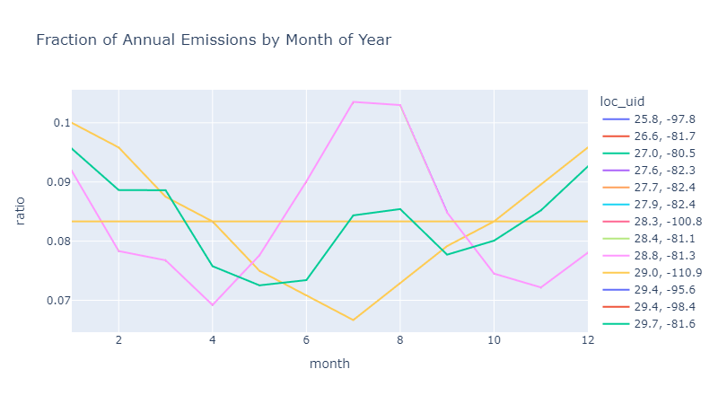
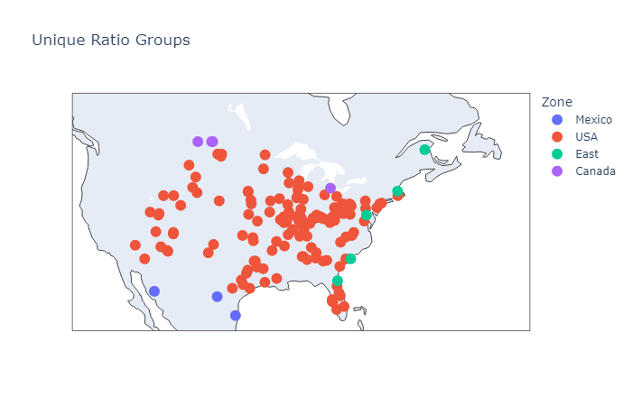
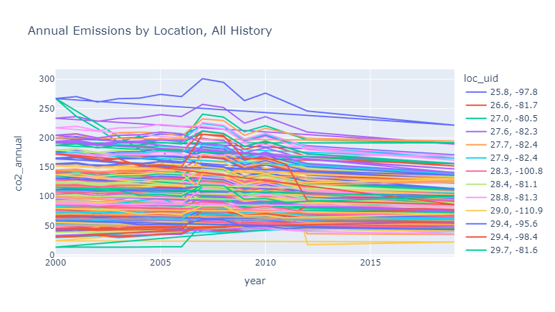

## Introduction

The importance of Carbon Capture, Utilization, and Storage (CCUS) technology is growing as governments take more aggressive steps to manage CO2 in the atmosphere. The feasibility of capturing CO2 particularly depends on the economic viability of the project. 

This challenge directs us to predict future carbon emissions in the United States for specific locations, based on prior monthly emissions data for these same locations. The training data includes monthly data for 153 locations from January 2000 through December 2019. We will need to make predictions for the twelve months of 2020.

## Monthly Model

We observed a trend in the data in how monthly CO2 emissions relate to annual emmissions. When we plot these ratios of monthly to annual emissions for all of the individual locations, it's clear there are four distinct groupings. Surprisingly, these ratios are perfectly consistent. If a location has 10% of it's annual emisions in January one year, it will have 10% of it's annual emissions in January every other year! 

When mapped, it looks like ratio groupings are distinct for USA, US-East, Mexico, and Canada, so we can name them.

## Yearly Model

Since we have a perfect way of allocating yearly data down to the monthly level, now our task becomes simpler. We just need a way to predict the yearly emmisions for each location in 2020. Let's take a look at the yearly data to see if there's any obvious trend.

This looks pretty interesting! There's a straight line trend starting in 2012. So to predict yearly emissions by location in 2020, we simply need to fit a linear model to these annual emissions data.

## Making Predictions

By combining our annual linear model with the monthly ratios, we're able to predict emissions for 2020. Our predictions acheive an RMSE of zero. 

## Conclusions

We can conclude that the data used in this challenge (provided by the Copernicus Atmosphere Monitoring Service) is itself derived from a model. For more comprehensive efforts to model carbon emissions, it would be a good idea to investigate the methodology they use to generate this data.

This problem teaches us about the importance of *data visualization*. By plotting this data, we were able to see clear trends in the emissions data, allowing us to build a highly accurate model. 
